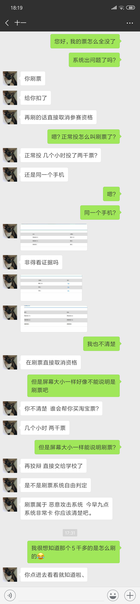
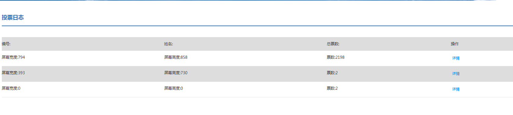

# AutoVoting-for-Yunmai
###go down if you want to see the Chinese simplified version.###
###中文版本请下拉###
##0x01:Introduction##
I have coded an AutoVoting program, giving you a chance to be the most popular on YUNMAI VOTING（云麦投票） 

Here is their [Voting System](http://www.mianfeitoupiao.com/).

I have joined an competition of our school (Lanzhou University) , which needs voting. So, when the voting started in the afternoon of 20th November,2018. Without any classes to take that time, I started coding.

Such kind of system base on Wechat id combined with openid to vote.

The Voting System is really simple and stupid, because they even don't detect the ip adress and have critical bugs for me to use. With a couple of hours, using Google Chrome and Fiddler, I easily get the code done!(Even though it's my first time to use Python to code on my own!)
## 0x02:How do I handle this##
 I use Google Chrome to view the source code of voting page(Eventhough JavaScript and HTML are new to me), and then I start to figure out what role the "vote" button play when I try to vote manually.

 After I take the first step, with Fiddler's monitoring, I vote manually. This helps me to confirm that I really understand how the voting system works and nothing is neglected.

 Finally, I start to code and debug. 

 you have to limit your voting speed at 14.5 s/vote . Otherwise you will be unable to vote for 2 hours after you have vote yourself for 500 votes.
 
 It turns out to be a success!
## 0x03:Result##
That night and next day, I kept voting for myself untill the afternoon, when I found that all my vote was gone. Then I asked the Customer Service.
;

The pictures shows the chat，it turned out to be the pace of the voting that makes them realized the abnormal. The funny thing is that, they thought I buy the voters on Tabao, but the truth is that I vote myself all by my program. HA HA HA......:)

When I followed her instruction to click into the number 1's voting page, who has votes of over 5000, I thought that they hire a lot of people to vote her on Tabao originally, tt really shocked me a lot.There is a link to buy the votes with money officially! and 666 votes cost 100 yuan.The voting system turned out to be a place to show off their whealth! I was disappointed with this competition from then on and decided to give up continue to take part in this activity.

## PS##
[The Voting Page HTML/Source Code(Local)(the NO.1's Voting Page)](觅冬.html)

[My Program Source Code](AutoVoting-for-Yunmai.py)

#云麦投票系统自动刷票程序#
##0x01:简介##
云麦投票系统自动刷票程序，让你轻松占据榜首。（当然，小心被封）

这是[云麦投票系统](http://www.mianfeitoupiao.com/)的链接。

我参加了我们学校（兰州大学）的比赛，需要投票。 所以，在2018年11月20日下午投票开始的时候，我没课，所以我开始编写程序。

这种投票系统基于微信id和openid结合识别区分用户进行投票。

投票系统非常简单和愚蠢，因为他们甚至没有检测IP地址，并且有重要的设计缺陷供我利用。 使用Google Chrome和Fiddler几个小时后，我轻松完成了代码！（即使这是我第一次使用Python自行设计程序！）

## 0x02：我的方法##
我首先使用谷歌浏览器（F12）来查看投票页面的源代码（尽管JavaScript和HTML我并不熟悉），然后我开始弄清楚当我尝试手动投票时“投票”按钮的作用。

之后在Fiddler的监控下，我尝试手动投票。 这有助于我确认我真的理解投票系统是如何运作的，并且没有因素被忽略。

最后，我开始编写代码并进行调试。

必须将投票速度限制在14.5秒/票。 否则，在投500票后，系统将限制2小时内无法投票。
 
最后我成功了！

## 0x03：结果##
那天晚上和第二天，我一直为自己投票，直到下午，当我发现我的所有投票都没有了。然后我问了客服。

他们认为我在淘宝买了刷票的，然而我是DIY的。太好笑了，哈哈哈······ :)

然后，我按她的指示点进了那个第一名的投票页面，她的票超过5000个，我本认为他在淘宝买了刷票的，然而，原来是不停的有人赠送礼物（666票100元）,本来正常的比赛，硬生生地变成了用钱砸出来的奖。从那时起我对这场比赛感到失望，并决定放弃继续参加这项活动。

## 0x04 附录##
[投票网页 HTML/源代码(本地)(第一名的投票地址)](觅冬.html)

[程序源代码](AutoVoting-for-Yunmai.py)