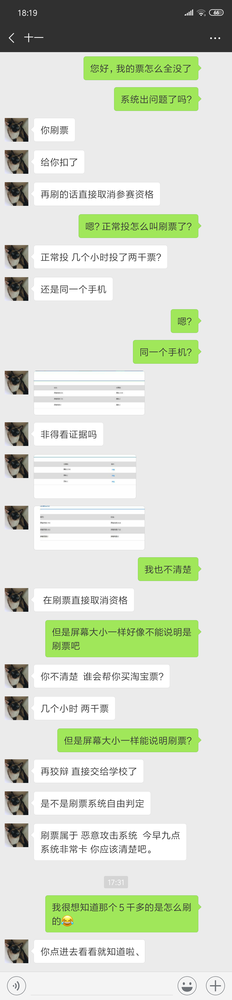
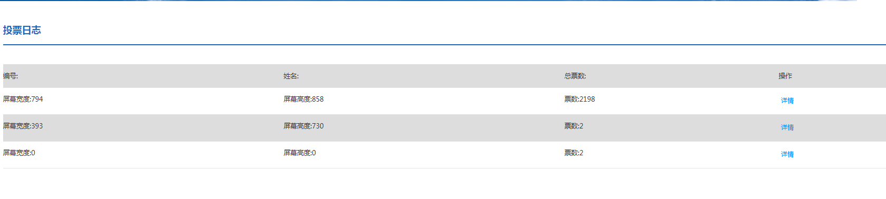
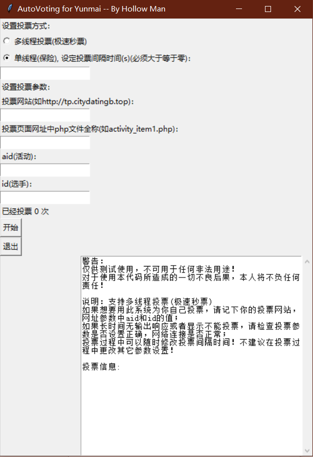
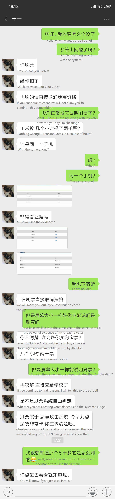
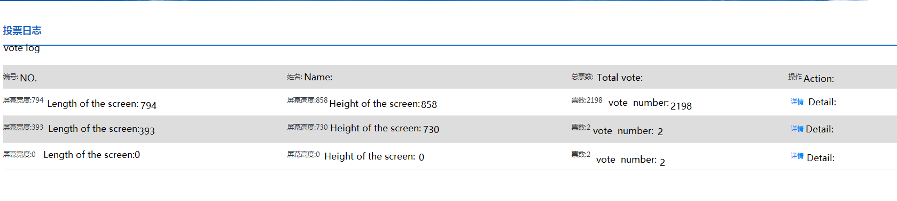

# 云麦投票系统自动刷票程序

(English version is down below.)

该[钻石投票平台](http://www.mianfeitoupiao.com/)现在已经被封了，此程序也无用武之地了，所以作为我写的第一个爬虫程序，谨以此仓库作纪念。

***注意：我们学校自媒体兰小e于2019年4月22日报道了这样一篇文章：[遇到这样的投票活动需要警惕](https://mp.weixin.qq.com/s?__biz=MzA4MTk1NDAzOA==&mid=2653775571&idx=2&sn=f20e4c06e74509eed027666bc482a447&chksm=8454d34ab3235a5ce0e90af10624b034e56291f89653e51a605a0ccc4269a598e0e02d0ac26b&mpshare=1&scene=22&srcid=1016BWf7zLa4vbYxXqFMBM4x&sharer_sharetime=1571203044591&sharer_shareid=810f66eeff1cb358c0ce3ae749467517#rd)，此类可以大规模刷礼物送票的投票活动均为坑钱的活动，请勿在这类投票活动中花钱刷礼物。***

## 最新消息

关于此项目的引申论文终于发表出版了！本论文由本人独立撰写，提出了关于投票真实安全问题的独创解决方案——“基于微信支付平台的在线投票系统”，发表于《软件》杂志第40卷第3期118-121页。

[知网链接](http://kns.cnki.net/kcms/detail/detail.aspx?dbcode=CJFD&filename=RJZZ201903023&dbname=CJFDPREP&uid=WEEvREcwSlJHSldRa1FhdkJkVG1BVmpVai8vVGU1U0ZiWnIxRUJTWVZ6cz0=$9A4hF_YAuvQ5obgVAqNKPCYcEjKensW4IQMovwHtwkF4VYPoHbKxJw!!)

[原文查看](https://hollowman6.github.io/Publications/?id=0)

**分类号: TP309.2**

**文献标识码: A**

**DOI: 10.3969/j.issn.1003-6970.2019.03.022**

**著录格式: 蒋嵩林. 基于微信支付平台的在线投票系统[J]. 软件, 2019, 40 (3) : 118-121**

欢迎引用！

***《软件》杂志介绍***

*《软件》杂志由中国科协主管，中国电子学会主办国内国际发行优秀科技期刊，创刊历史悠久，1979年创刊。系中国首届中文核心期刊。国家新闻出版总署批准国内标准刊号：CN12-1151/TP，国际统一刊号：ISSN1003-6970，中国国际图书贸易总公司国外发行，国外发行代号：M8992。同时国内唯一《软件》杂志光盘版刊号：CN12-9203/TP。《软件》杂志被国内外数据库收录《中国学术期刊综合评价数据库统计源期刊》、《中国核心期刊（遴选）数据库收录期刊》、《中国期刊全文数据库》、《中文科技期刊数据库（全文版）收录期刊》。*

***（2018）影响因子：1.038***

*[杂志社主页](http://www.rjzz.cbpt.cnki.net/WKE/WebPublication/index.aspx?mid=RJZZ)*

## 简介

[Python库依赖](../../network/dependencies)

云麦投票系统自动刷票程序，让你轻松占据榜首。（当然，小心被发现！）

这是[云麦投票系统](http://www.mianfeitoupiao.com/)的链接。

我参加了我们学校（兰州大学）的比赛，需要投票。 所以，在2018年11月20日下午投票开始的时候，我没课，所以我开始编写程序。

这种投票系统基于微信id和openid结合识别区分用户进行投票。

投票系统非常简单和愚蠢，因为他们甚至没有检测IP地址，并且有重要的设计缺陷供我利用。（具体缺陷请参考代码与代码中的注释，以及附录提供的样例页面） 使用Google Chrome和Fiddler几个小时后，我轻松完成了代码的编写！（即使这是我第一次使用Python自行设计程序！）

## 我的方法

我首先使用谷歌浏览器（F12）来查看投票页面的源代码（尽管JavaScript和HTML我并不熟悉），然后我开始弄清楚当我尝试手动投票时“投票”按钮的作用。

之后在Fiddler的监控下，我尝试手动投票。 这有助于我确认我真的理解投票系统是如何运作的，并且没有涉及投票的因素被忽略。

最后，我开始编写代码并进行调试。

必须将投票速度限制在14.5秒/票。 否则，在投500票后，系统将限制2小时内无法投票。
 
最后我成功了！

## 结果

那天晚上和第二天，我一直运行着程序，为自己投票，直到下午，我发现我的所有投票都没有了。然后我问了客服。

从上图可知，是投票的速度暴露了我。但是，他们认为我在淘宝买了刷票的，然而我是靠自己的技术攻破的。太好笑了······ :)

然后，我按她的指示点进了那个第一名的投票页面，她的票超过5000个，我本认为她是在淘宝买了票，然而，原来是不停的有人赠送礼物换算成票（666票100元）,本来正常的摄影比赛，硬生生地变成了用钱砸出来的。从那时起我对这场比赛感到失望，并决定放弃继续参加这项活动。

2019年4月6日，我向程序中添加了可选功能——多线程。

2019年4月25日，修复一些错误。添加 UI 界面版程序:

## 附录

[投票网页 HTML/源代码(本地)(第一名的投票地址)](觅冬.html)

[程序源代码](AutoVoting-for-Yunmai.py)

[UI版程序源代码](AutoVoting-for-Yunmai-with-UI.py)

[Win UI程序](Excutables/AutoVoting-for-Yunmai-with-UI.exe)

# Auto Voting for Yunmai

This [Voting platform] (http://www.mianfeitoupiao.com/) is now closed, so this programme is now useless. Therefore, as the first crawler program I coded, I would like to use this repository as a memorial.

***Attention！Our university student media “兰小e” writes an article: [you should be careful to such kind og voting activities(in Chinese)](https://mp.weixin.qq.com/s?__biz=MzA4MTk1NDAzOA==&mid=2653775571&idx=2&sn=f20e4c06e74509eed027666bc482a447&chksm=8454d34ab3235a5ce0e90af10624b034e56291f89653e51a605a0ccc4269a598e0e02d0ac26b&mpshare=1&scene=22&srcid=1016BWf7zLa4vbYxXqFMBM4x&sharer_sharetime=1571203044591&sharer_shareid=810f66eeff1cb358c0ce3ae749467517#rd) on April 22, 2019. Such kind of activities are all fake, please DO NOT spend any money on those activities.***

## LATEST NEWS

Extended paper on this project have finally been published! Written independently by myself, this paper presents an original solution to the real security of voting - "Voting System Based on Wechat Pay", which is published in Volume 40, No. 3, page 118-121, at "COMPUTER ENGINEERING & SOFTWARE" journal.

[Link to CNKI](http://kns.cnki.net/kcms/detail/detail.aspx?dbcode=CJFD&filename=RJZZ201903023&dbname=CJFDPREP&uid=WEEvREcwSlJHSldRa1FhdkJkVG1BVmpVai8vVGU1U0ZiWnIxRUJTWVZ6cz0=$9A4hF_YAuvQ5obgVAqNKPCYcEjKensW4IQMovwHtwkF4VYPoHbKxJw!!)

[Article view](https://hollowman6.github.io/Publications/?id=0)

**Classification number: TP309.2**

**Document identification code: A**

**DOI: 10.3969/j.issn.1003-6970.2019.03.022**

**Citation Format: 蒋嵩林. 基于微信支付平台的在线投票系统[J]. 软件, 2019, 40 (3) : 118-121**

Welcome for your citation!

***Introduction of "COMPUTER ENGINEERING & SOFTWARE" journal***

*"COMPUTER ENGINEERING & SOFTWARE" journal is managed by the Chinese Association of Science and Technology and sponsored by the China Electronics Society. It has a long history of publishing excellent scientific and technological journals at home and abroad. It was founded in 1979. It is the first Chinese core journal in China. China International Book Trading Corporation Code : CN12-1151/TP. ISSN 1003-6970. M8992, is the code for international publishing approved by the General Administration of Press and Publication. Meanwhile, the only CD-ROM edition of Software magazine in China is CN12-9203/TP. Software magazine is included in Chinese Academic Journal Comprehensive Evaluation Database Statistical Source Journal, Chinese Core Journal (Selection) Database, Chinese Journal Full Text Database and Chinese Science and Technology Journal Database (Full Text Edition) by domestic and foreign databases.*

***（2018）Impact factor ：1.038***

*[Publisher's HomePage](http://www.rjzz.cbpt.cnki.net/WKE/WebPublication/index.aspx?mid=RJZZ)*

## Introduction

[Python Dependencies](../../network/dependencies)

I have coded an AutoVoting program, giving you a chance to be the most popular on YUNMAI VOTING（云麦投票） 

Here is their [Voting System](http://www.mianfeitoupiao.com/).

I have joined an competition of our school (Lanzhou University) , which needed voting. So, when the voting started in the afternoon of 20th November,2018. Without any classes to take that time, I started coding.

Such kind of system base on Wechat id combined with openid to vote.

The Voting System is really simple and stupid, because they even don't detect the ip adress and have critical bugs for me to use. With a couple of hours, using Google Chrome and Fiddler, I easily got the code done!(Even though it was my first time to use Python to code on my own!)

## How did I handle this

 I used Google Chrome to view the source code of voting page(Eventhough JavaScript and HTML are new to me), and then I start to figure out what role the "vote" button played when I tried to vote manually.

 After I took the first step, with Fiddler's monitoring, I tried to vote manually. This helped me to confirm that I really understood how the voting system works and nothing was neglected.

 Finally, I started to code and debug. 

 you have to limit your voting speed at 14.5 s/vote . Otherwise you will be unable to vote for 2 hours after you have vote yourself for 500 votes.
 
 It turned out to be a success!

## Result

That night and next day, I kept voting for myself untill the afternoon, when I found that all my vote was gone. Then I asked the Customer Service.

The pictures shows the chat，it turned out to be the pace of the voting that makes them realized the abnormal. The funny thing is that, they thought I buy the voters on Tabao, but the truth is that I vote myself all by my program. HA HA HA...... :)

When I followed her instruction to click into the number 1's voting page, who has votes of over 5000, I thought that they hire a lot of people to vote her on Tabao originally, it really shocked me a lot.There is a link to buy the votes with money officially! and 666 votes cost 100 yuan.The voting system turned out to be a place to show off their whealth! I was disappointed with this competition from then on and decided to give up continue to take part in this activity.

On 6th April,2019 , I add an optional funtion --- multithreading.

On 25th April,2019 , I fixed some bugs, add Program with UI version.

## PS

[The Voting Page HTML/Source Code(Local)(the NO.1's Voting Page)](觅冬.html)

[My Program Source Code](AutoVoting-for-Yunmai.py)

[My Program with UI Source Code](AutoVoting-for-Yunmai-with-UI.py)

[Windows UI Programme](Excutables/AutoVoting-for-Yunmai-with-UI.exe)
